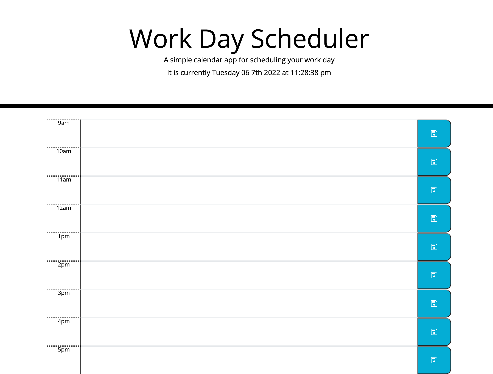

# schedule-app
***
This app lets the user input daily tasks into a 9am-5pm schedule. It displays the date and time and color codes past, present, and future tasks. When the user inputs text and clicks the save icon it is saved to the local storage. 
***
site: https://armando1236.github.io/schedule-app/
Github: https://github.com/armando1236/schedule-app.git
***
used JavaScript, CSS, BootStrap, and HTML on Visual Studio Code
***

